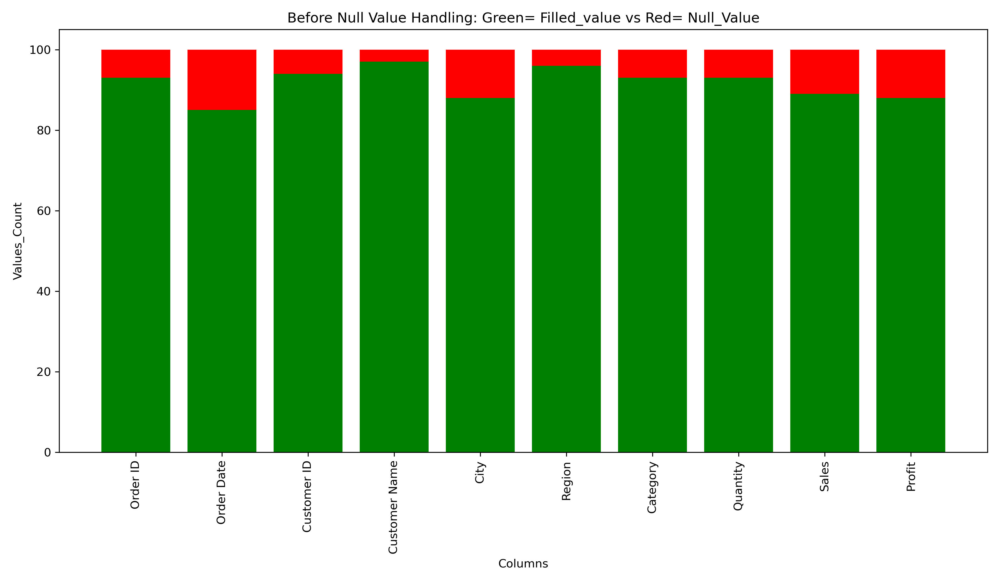
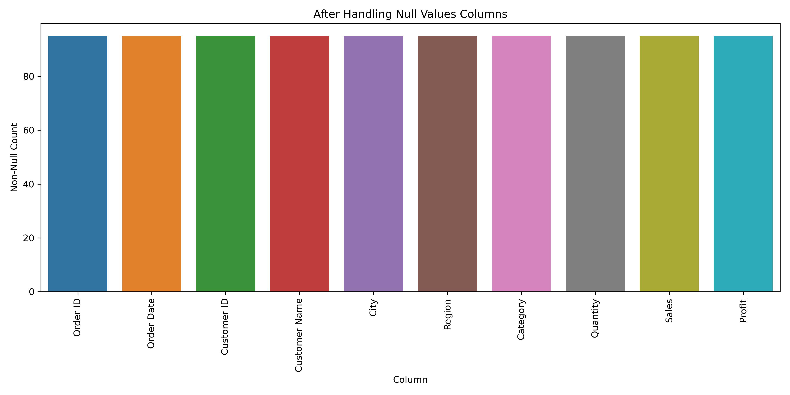

# 🛒 Walmart Null Value Handling Project

---

## 📌 Project Objective
This project focuses on identifying and handling missing values in a simulated real-world Walmart sales dataset. The goal was to apply thoughtful, column-specific strategies to clean the data and make it ready for further analysis.

---

## 📂 Folder Structure
- `01_Dataset/`
  - Raw dataset with null values
  - Cleaned dataset (Excel)
- `02_Notebook/`
  - Jupyter notebook with full null handling process
- `03_Documentation/`
  - PDF report explaining methods and decisions
- `04_Images/`
  - Before and after null value visualizations

---

## 🧠 Null Value Handling Strategy

| Column         | Type        | Missing Values | Handling Strategy                                                  |
|----------------|-------------|----------------|--------------------------------------------------------------------|
| Order ID       | Identifier  | 7              | Filled with `'Unknown'`                                            |
| Customer ID    | Identifier  | 6              | Filled with `'Unknown'`                                            |
| Customer Name  | Identifier  | 3              | Filled with `'Unknown'`                                            |
| Order Date     | Date        | 15             | Imputed manually using year/month distribution and region logic    |
| City           | Categorical | 12             | Filled with `'Unknown'`                                            |
| Region         | Categorical | 4              | Inferred using City; dropped row if unmatched                      |
| Category       | Categorical | 7              | Filled using frequency + region-category relationships             |
| Quantity       | Numeric     | 7              | Inferred using similar records (category, region, date)            |
| Sales          | Numeric     | 11             | Filled using average sales by category/region                      |
| Profit         | Numeric     | 12             | Filled with `0.0` (assumed no profit or unknown)                   |

---

| Before Cleaning                                                  |
|----------------------------------------|
| 

| After Cleaning  
|----------------------------------------|
|  

---

## 🛠️ Tools Used
- **Python 3.x**
- **Jupyter Notebook**
- **Pandas, NumPy**
- **Matplotlib, Seaborn**
- **Excel (for output dataset)**

---

## 📌 Key Learnings

- Handling missing data requires **context-aware decisions**.
- Not all columns should be treated the same — identifiers, dates, categories, and numbers each need different approaches.
- Visualizing before and after null handling helps verify the effectiveness of your strategy.
- Clean data is critical for valid future analysis like sales trends, customer segmentation, or forecasting.

---

## 🙋‍♂️ About Me
Aspiring Data Analyst skilled in Python, Power BI, SQL, and Excel.

## 📬 Contact
**Siddeswaran K**
- Email: [siddesanalyst@gmail.com]
- Contact: [+91 9080526503]
- GitHub: [https://github.com/Siddes-Analyst]
- GitHub Pages: [https://siddes-analyst.github.io/01_Walmart_Null_Values_Handling_Overall/] 
